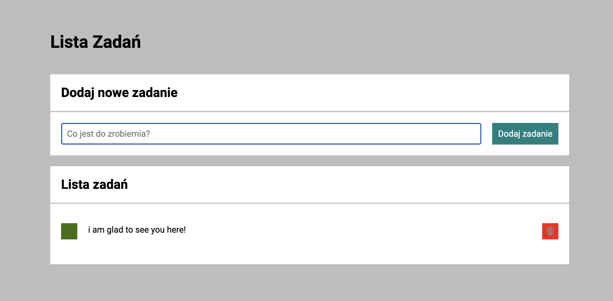

# Tasks-Listu

Hello everyone!
I am glad to see youy here. 

On the botyom i atatched a link to my tasks list aplication. 
I hope you enjoy it. 

## How it work?

To add the new task you need to write it in the form field and then click to "Dodaj zadanie".

If you task is done already, you can click to green square to check it as done or you can also delete this task through click a red square with bin icon. 

## Techniques used

1. BEM convention
2. Arrow functions
3. ECMA script 6

## Link and how it look like!

[Link do listy zadań](https://lukasz-tatara-1997.github.io/Tasks-Listu/)

